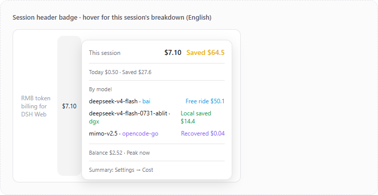
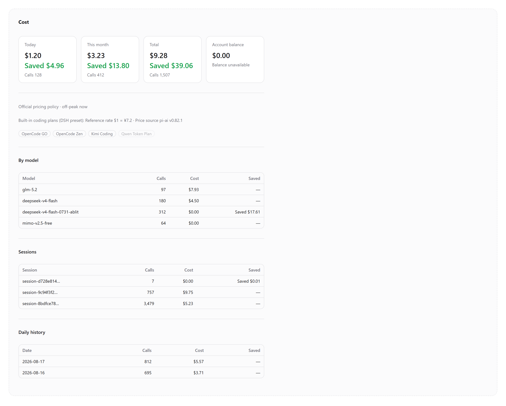

# dsh-web-billing

[简体中文](README.md) · **English**

[](LICENSE)
[](https://github.com/bpc-oss/dsh-web-billing/stargazers)
[](https://github.com/bpc-oss/dsh-web-billing/releases)
[](https://github.com/topics/dsh-plugin)

A RMB/USD token-billing plugin for DeepSeek Harness (`dsh web` / desktop).
Bills every LLM call automatically against the **official DeepSeek pricing
policy schedule** (including peak/off-peak pricing effective 2026-08-17),
persists a ledger, shows the **account balance**, and renders live cost badges
in the browser — **displaying USD when the UI language is English**.

**In one line**: make your AI spend visible, itemized, and optimizable — official
prices auto-follow, local/subscription/free-ride are classified precisely,
history re-prices on demand, budget and balance are always visible.

> ⚠️ Token and cost figures are a **local DSH ledger**: only completed
> `assistant/message` events captured in this `$DSH_HOME` after the plugin was
> installed. They are not the official DeepSeek account invoice. The balance
> comes from `/user/balance`; reconcile usage across API keys and applications
> with the DeepSeek console Usage export.

---

## 📸 Screenshots

| Session header badge (hover for this-session details) | Settings → Cost page (full page, English UI) |
| --- | --- |
|  |  |

> Screenshots above are from the English UI; the Chinese-UI equivalents are
> in [README.md](README.md) (the shared `settings-*.png` captures are
> Chinese-UI screenshots).

---

## ✨ Key features

### 1. Official policy auto-pricing (peak/off-peak)

`lib/pricing.js` ships a curated official policy schedule
(`OFFICIAL_PRICING_POLICIES`):

| Effective (Beijing) | Policy | Model prices (¥/1M; cache-hit / cache-miss / output) |
|---|---|---|
| 2025-02-09 | deepseek-chat / deepseek-reasoner standard | 0.5/2/8 · 1/4/16 |
| 2026-05-22 | V4 series 75% cut made permanent | v4-flash 0.02/1/2 · v4-pro 0.025/3/6 |
| 2026-08-17 | **Peak/off-peak** (peak 09:00-12:00 / 14:00-18:00 Beijing; off-peak = half) | see below |

Peak/off-peak prices (¥/1M):

| Model | Off-peak (cache-hit / miss / output) | Peak (cache-hit / miss / output) |
|---|---|---|
| deepseek-v4-flash | 0.05 / 1.5 / 4.5 | 0.10 / 3.0 / 9.0 |
| deepseek-v4-pro | 0.15 / 4.5 / 13.5 | 0.30 / 9.0 / 27.0 |

Semantics:

- **Priced by message time**: each message is billed with the policy and phase
  active at its completion time; new policies apply automatically.
- **Policy-chain inheritance**: a model not named by a newer policy keeps its
  last named price (historical bills stay consistent with the platform).
- **Self-healing**: when the schedule or config changes, the ledger is re-priced
  on restart using each record's stored token counts.
- **User overrides**: exact model entries in `prices` override the official
  table; `*` only fills models the official table never named.
  `officialPricing: off` uses only the user table.
- **Extensible**: append future official price changes via `policyOverrides`
  config — no code change needed (PRs to `lib/pricing.js` welcome).

> The schedule is curated from official announcements
> ([DeepSeek API Docs](https://api-docs.deepseek.com/zh-cn/quick_start/pricing/));
> verify against the official page and send a PR if you spot drift.

### 2. Coding-plan billing (full DSH preset coverage)

Besides the DeepSeek official API, you can connect various **coding plans**
(subscription coding bundles) in DSH, such as `opencode-go` / `opencode` /
`kimi-coding`, plus qwen / xiaomi / z.ai token subscription packs. This plugin
ships **the official USD prices for every model on these platforms** (sourced
from the DeepSeek Harness official pi-ai catalog, see `lib/coding-plans.js`),
and prices by **provider routing**:

- **Official platform prices** (`opencode-go` / `opencode` / `kimi-coding`): each
  model's USD price ($/1M) is published by the platform. The RMB display value =
  official USD price × `codingUsdCnyRate` (default reference rate 7.2; display
  conversion only — **DeepSeek's own prices have official CNY and never use this
  rate**).
- **Subscription token packs** (`qwen-token-plan` (incl. `-cn`) /
  `xiaomi-token-plan` (incl. `-ams`/`-cn`/`-sgp`) / `zai-coding-cn`): no
  per-token price is published; calls are within the subscription allowance and
  are billed at **0**.
- **Routing rule**: a message takes the coding-plan route only when both
  `(provider, model)` match that platform's table; anything else keeps the
  DeepSeek official policy chain (including peak/off-peak). The same model name
  (e.g. `glm-5.2`) is billed at opencode's official price under `opencode-go`
  and at each platform's own price under a direct API — never cross-priced.
- **Follows official automatically**: regenerate the price table any time from
  your local DSH catalog with `node scripts/sync-coding-plans.mjs`; the source
  version (pi-ai version + generated time) is part of the pricing fingerprint,
  so a table change re-prices history on restart.

> Unlike the DeepSeek official prices, coding plans have only official USD
> prices — the RMB figures are a **reference conversion** at
> `codingUsdCnyRate` (configurable); the USD figures are always the official
> truth.

### 3. Provider metering (billing model)

Each provider can have its own billing model (Settings → Cost → Provider
metering, **takes effect immediately — no restart**):

| Mode | Meaning |
|---|---|
| `usage` | Pay-per-use: billed at the official/platform price |
| `usage-free` | Usage + free ride: pay-per-use, but models on the **free-model list** are billed at 0 |
| `subscription` | Subscription: fixed monthly fee (`monthly`), calls billed at 0, nominal value shown as "recovered" |
| `free` | Promo-free: calls billed at 0 (genuinely free) |
| `local` | Self-hosted: calls billed at 0 (you save the API cost) |

- **Free-ride picks**: the settings page lists every free model from the
  pi-ai catalog (`openrouter` 17 / `nvidia` 16 / `opencode` 7 / `google` 2 /
  `huggingface` 1 / `mistral` 1 / `vercel-ai-gateway` 3 …; see
  `lib/promo-models.js`, generated by `scripts/sync-promo-models.mjs`) as a
  compact hint; rerun the script after DSH upgrades to refresh the promo data.
- **History re-pricing**: switching a billing model **immediately re-prices all
  history** (free/subscription/local records drop to 0 cost and become nominal
  savings) — no restart.
- **Recovery view**: subscription monthly fee vs cumulative recovered amount,
  visible in source groups and the header panel.

### 4. Cost page (Settings → Cost)

The browser-side summary page (read-only plus a few immediate settings):

- **Time-range filter**: today / this week / this month / last 30 days / all /
  custom start-end; every module (overview / sources / models / sessions /
  history) follows the range; defaults to this month.
- **Overview & source breakdown**: range card (cost + **gold** saved total +
  source strip), today / total / Token / balance cards.
- **Token stats**: total tokens split into input (miss) / cache-hit / output —
  cache-hit rate at a glance.
- **Source groups**: local-saved / subscription-recovered / free-ride / usage,
  each with a semantic accent bar and detail rows (pure savings tinted by
  source; real paid calls stay neutral).
- **Monthly budget**: set a ¥ monthly budget; progress bar green→amber→red with
  red over-budget highlight; budget stays locked to the current month.
- **Header balance toggle**: controls whether the session-header badge shows the
  balance; the settings page always shows it.
- **Data integrity**: ledger view-consistency self-check (`integrity`) plus
  explicit historical-trimming gaps (`bdpGap` / `repriceGap`) — gaps are
  visible and reconcilable, never silently shrink the ledger.
- **Export**: CSV (UTF-8 BOM) / JSON one-click download.
- **Session titles**: session list shows titles instead of UUIDs.
- **Version & updates**: at the bottom — checks GitHub Releases for a newer
  version and links to it.

> Aggregation note: range details come from the recent-ledger window
> (`maxRecent`, default 100000 records); older data is aggregate-level only
> (day totals are always full).

### 5. Session-header badge (top-right)

- **This session's today / cumulative** cost + savings (savings total is
  **gold**, distinct from per-source colors).
- **Per-model stats**: cumulative amount per model + Input / cache-hit-rate /
  Output; provider tags tinted by source (local green / free-ride sky /
  recovered purple / usage gray).
- **Per-model gap hint**: when historical migration/trimming leaves the per-model
  total below the session total, the panel shows an amber hint
  (`Model split gap (trimmed history not in per-model rows) ¥X`) — the money is
  NOT lost (it stays in the totals), it just can no longer be attributed to a
  specific model row; new data never shows this hint.
- **Balance row** (toggleable): official account balance.
- **DeepSeek peak/off-peak hint**: shows the current phase when the session
  uses DeepSeek-family models.
- **Panel UX**: rendered via React portal (never covered by the sidebar),
  anchored to the badge, opaque themed background, hover auto-open/close.

### 6. Account balance

Reuses the provider's API key to call the official `GET /user/balance`
(60s refresh, 5s timeout); CNY/USD both reported with the billing state. A
transient failure (timeout / network hiccup) does NOT erase the last proven
balance — the stale value is kept (the settings page subtitle reads "Balance
from the last successful query (current query failed; retrying automatically)")
while periodic refreshes retry; only a never-succeeded query shows
"Unavailable". The runtime toggle controls the header display
(`balance.enabled` or the settings toggle; turning it off stops polling and
stops using the API key).

### 7. Pricing intel (current unit prices & next transition)

`/billing/state` exposes pricing intel for the client and external tools:

- `currentUnitPrices`: the currently effective official unit prices
  (dual currency + peak/off-peak mode);
- `nextTransitionAt`: the next peak/off-peak or policy switch (epoch ms;
  probed within 72h, `null` beyond — cannot actually happen since peak/off-peak
  switches daily), computed by `nextPricingTransition` in `lib/pricing.js`
  (hour probing then binary search to the second — crosses future policy
  boundaries);
- `observedAt` / `refreshIntervalMs`: observation time and suggested refresh
  interval (1h);
- `source`: the official pricing page the schedule is curated from.

## Install

The plugin is a standard DSH **bundle** (`dsh.bundle.patch` → its own
`cordis.patch.yml`), following the official
[packaging guide](https://github.com/deepseek-ai/deepseek-harness/blob/master/docs/user/develop/basic/publish.md):

```powershell
# From GitHub
dsh plugin --profile web add github:<owner>/dsh-web-billing
# Or from npm (once published)
dsh plugin --profile web add dsh-web-billing
# Or link a local checkout (no copy; edits take effect on restart)
powershell -ExecutionPolicy Bypass -File scripts/install.ps1 -Profile web
```

> On git installs, pnpm >=10 may ask for a build authorization: add the
> prompted package key to `pnpm-workspace.yaml` `allowBuilds` in the profile
> and retry (this package has no `prepare` build, so authorization is
> usually not needed).

Restart `dsh web` afterwards. Run only one instance per ``$DSH_HOME``
(multiple instances would contend for the same ledger file). To override
defaults, rewrite the plugin config row in
`$DSH_HOME/profiles/web/cordis.patch.yml` — the patch replaces the whole
row's config, so restate every key you keep:

## Configuration

| Key | Default | Meaning |
|---|---|---|
| `currency` | `CNY` | Currency identifier |
| `symbol` | `¥` | RMB display symbol |
| `symbolUsd` | `$` | USD display symbol |
| `displayCurrency` | `auto` | `auto`=follow UI language; `CNY`/`USD` forces one |
| `timezone` | `Asia/Shanghai` | IANA timezone for peak/off-peak windows |
| `peakWindows` | `[[9,12],[14,18]]` | Peak hours (local, `[start,end)`) |
| `officialPricing` | `auto` | `auto`=official auto-pricing; `off`=use only `prices` |
| `prices` | `{}` | User price table (override/fallback, ¥/1M) |
| `usdPrices` | `{}` | Optional USD overrides ($/1M) |
| `localProviders` | `[]` | Self-hosted providers: official value, actual cost at `localCostPerM`, difference = savings |
| `localCostPerM` | `0` | Actual local cost (¥/1M, uniform; 0 = free) |
| `codingUsdCnyRate` | `7.2` | Reference $→¥ rate for coding-plan USD prices (display only) |
| `policyOverrides` | `[]` | Extra official policy entries (`since` required; `prices` or `peak`+`offPeak`) |
| `persistPath` | `~/.dsh/storages/web-billing.json` | Ledger file path |
| `maxRecent` | `100000` | Recent-ledger window (range details) |
| `maxMessagesPerSession` | `2000` | Per-session message detail cap |
| `loopbackOnly` | `true` | `/billing` endpoints loopback-only |
| `balance.enabled` | `true` | Initial header-balance enabled state |
| `balance.endpoint` | `https://api.deepseek.com/user/balance` | Balance endpoint (prefixed with `DEEPSEEK_BASE_URL` when set) |
| `balance.apiKeyEnv` | `DEEPSEEK_API_KEY` | Credential reference for the API key |
| `balance.refreshMs` | `60000` | Balance refresh interval |
| `balance.timeoutMs` | `5000` | Balance request timeout |
| `metering` | `{}` | Static billing-model table: `{ provider: { mode, monthly?, freeModels? } }` (runtime edits persist to `web-billing-metering.json`) |

Unit fields: `input`=cache-miss input, `cacheRead`=cache-hit input, `output`=output (¥ per million tokens).

## Ledger correctness

- **Idempotent**: keyed by `(sessionId, messageId)`; replayed/duplicate events are skipped entirely (first write wins — global counts, session aggregates and details all recognize the first write only). Restarts do NOT replay history (dsh-session constructor seeds do not emit events); idempotency covers in-run duplicate delivery within the retained message window.
- **Local timezone** for "today / this month".
- **Durability**: 1s debounce + atomic temp-file rename; flush on exit; a corrupt/unreadable ledger starts empty with a warning; warns when the ledger grows past 20MB (lower `maxRecent` / `maxMessagesPerSession`).
- **Audit fields**: `unitPrice` and pricing `mode` (`flat` / `peak` / `offPeak`) per message.
- **Reprice gap**: history revaluation (after price/metering changes) is bounded by the retained per-message records (session details ∪ recent window); messages trimmed from both cannot be repriced and their old-price contribution is lost on revaluation. The gap is surfaced explicitly as `repriceGap` in `/billing/state` and flagged on the cost page — never silently shrinks the ledger.
- **Per-model gap**: the per-model aggregates (`bySessionModel`) may total less than the session total on migrated ledgers (messages trimmed from both retained windows cannot be backfilled); the difference is returned as `modelGap` in `/billing/session/<id>` and flagged in the panel — money is not lost, only its per-model attribution.
- **Balance read-only**: only the official read endpoint; the key never reaches the browser.

## Security

- `/billing` endpoints loopback-only by default; `loopbackOnly: false` for LAN (no auth).
- **State-changing POSTs** (metering / budget / balance) additionally require a
  same-origin check: browser cross-site simple requests (text/plain POST) carry
  an `Origin`; it must match the `Host`. Requests without an `Origin` (local
  tools such as curl) are allowed (the loopback guard already restricts the
  source address).
- Reads `session/event` and serves read-only endpoints only - never mutates session data.
- Ledger stays local (`$DSH_HOME/storages/`), no message content, never uploaded.

## Develop

```powershell
npm run check   # syntax checks
npm test        # pricing / balance / ledger unit tests (node:test, zero deps)
node scripts/sync-coding-plans.mjs   # regenerate coding-plan prices from your DSH pi-ai catalog
```

Layout: `lib/pricing.js` (pricing engine incl. coding-plan route + metering),
`lib/coding-plans.js` (generated coding-plan prices),
`lib/promo-models.js` (generated free-model catalog), `lib/balance.js`,
`lib/index.js` (host: ledger, balance, metering/budget/balance toggle,
`/billing` routes), `lib/client.js`
(browser: session badge, message chip, Settings→Cost page; handwritten
bundle, no build step), `test/`, `scripts/`. The browser bundle is a handwritten module (same format as official DSH client plugins): client changes take effect after a page refresh + `dsh web` restart; host-side changes need a restart.

## Contributing / 贡献

PRs and issues are welcome (English or Chinese). This repository is maintained
**bilingually**: doc changes must update both `README.md` (Chinese) and
`README.en.md` (English), and config comments are bilingual. Full rules in
[CONTRIBUTING.md](CONTRIBUTING.md).

## License

MIT
